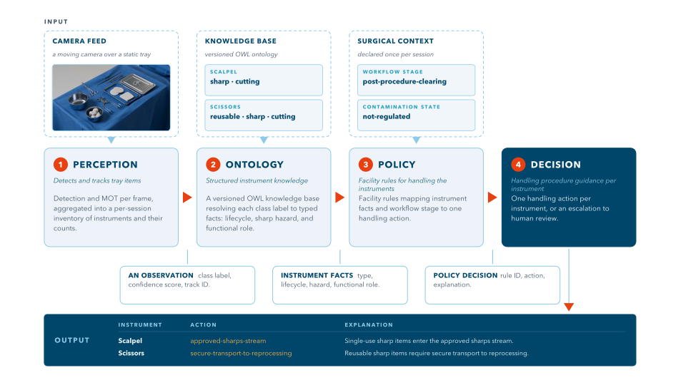

[](https://github.com/AhmedGhita1/SURGINT/actions/workflows/ci.yml) [](https://huggingface.co/spaces/AhmedGhita/surgint)

# SURGINT Instruments


*surgint-instruments is part of the surgical intelligence (SURGINT) family of projects.*

**SURGINT Instruments** is focused on surgical instruments inventory and handling procedures. It turns a surgical-tray video or live camera feed into an instrument inventory. It detects and tracks tray items using RT-DETR and ByteTracker, then applies explicit ontology-backed rules to produce handling procedure guidance.


> **Research demonstration only.** SURGINT Instruments has not been clinically validated, and must not be used for clinical decisions, patient care, or safety-critical instrument accounting.



## Run with Docker

Running the Docker image requires Docker, the NVIDIA Container Toolkit, and an NVIDIA driver
compatible with CUDA 12.1.

```bash
docker pull ghcr.io/ahmedghita1/surgint-instruments:1.0.0
docker run --rm --gpus all -p 7860:7860 \
  ghcr.io/ahmedghita1/surgint-instruments:1.0.0
```


## Development

SURGINT Instruments supports Python 3.10 and later. An editable development installation contains the model, serving, training, evaluation, rendering, and test dependencies:

```bash
python -m pip install -e ".[dev,render,serving,training]"
```

## Training and evaluation

Training and evaluation are offline workflows. They consume versioned datasets and produce reproducible run directories under `outputs/runs`.

Typical entry points:

```bash
# local training
python -m pipelines.train --config configs/train.yaml

# training tracked in W&B, with the best checkpoint logged as a candidate artifact
python -m pipelines.train --config configs/train.yaml \
  --wandb-project YOUR_WANDB_PROJECT --wandb-entity YOUR_WANDB_ENTITY

# detection evaluation
python -m pipelines.evaluate outputs/runs/<run-id>/best --config configs/eval.yaml

# end-to-end detection, tracking, and inventory evaluation
python -m pipelines.evaluate outputs/runs/<run-id>/best --config configs/eval_sessions.yaml
```

An already validated checkpoint can be registered separately:

```bash
python -m pipelines.register_model outputs/runs/<run-id>/best \
  --project YOUR_WANDB_PROJECT --entity YOUR_WANDB_ENTITY
```

## Citation

The following BibTeX entry cites this project:

```bibtex
@software{ghita_2026_surgint_instruments,
  author = {Ahmed Ghita},
  title = {SURGINT Instruments},
  year = {2026},
  version = {1.0.0},
  url = {https://github.com/AhmedGhita1/SURGINT}
}
```

## License

The source code is released under the [MIT License](LICENSE). Model weights and datasets are separate artifacts and may have their own license terms.
